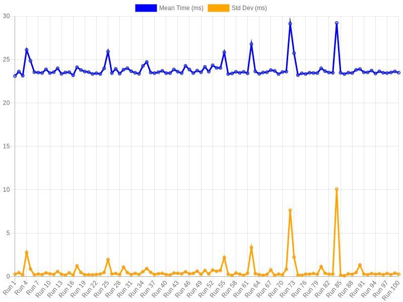

# DNANexus Large-File Read Challenge

## Overview

This PR contains my solution to the challenge defined on `exercise.md`.

My solution focuses on efficient handling of large files by creating a byte-offset index for fast random access, combined with performance benchmarking to validate the implementation.

It takes about **23ms** per read line, as you can see in the graph below



## Installation / Dependencies

This script doesn't depend on any external dependencies, only `node`.

## How to run this?

The program includes a CLI with the following usage:

```shell
node index.js <datasetFile> <lineNumber> [--verbose]
```

- `datasetFile`: Path to the dataset file.
- `lineNumber`: The line number to retrieve.
- `--verbose`: Optional flag for detailed logging.

### Example

```shell
node index.js dataset.txt 12345 --verbose
```

## 2. Dataset Generation

I created a script, `dataset-gen/generate-large-dataset.sh`, to generate a dataset of 100M lines (`~4.7GB`). The script works as follows:

- Generates 10M lines using random characters and numbers for content (`[a-Z][0-9]`). Each line is at most 1000 bytes long.
- Concatenates this smaller dataset 10 times to produce the final 100M-line dataset.

This approach ensures the dataset is large enough to demonstrate performance without being excessively large for practical use.

To generate the dataset, run:

```shell
cd dataset-gen && ./generate-large-dataset.sh
```

## 3. Benchmarking

I created a benchmarking script, [benchmark.sh](./benchmark.sh), to automate performance testing. The script:

- Passes random line numbers between 1 and 100M to the program.
- Measures execution time using `hyperfine` for accuracy.
- Outputs results to a CSV file: `benchmark-results/data.csv`.
- Generates a graph image and stores it in `benchmark-results/graph.png`

To run the benchmark:

```shell
./benchmark.sh
```

Please note: If you want to run the benchmark scripts, you'll also need to:

- install `hyperfine`
- install `jq`
- run `cd benchmark-results && npm i`

## 4. Thought Process

### Initial Approach

I knew loading the entire file into memory would be impractical for large datasets.

I decided to create an index file that stores the byte offsets (start and end) for each line in binary format, allowing us to know when each line starts and ends in the dataset without having to load it into memory.

This index is created during the first run if it doesn’t already exist.
It’s significantly smaller than the dataset itself (e.g., for a `4.7gB` dataset, the index is only `33mB`).

### Challenges and Optimizations

#### Naive Implementation

- Initially, I loaded the entire index file into memory. This approach took `~1` second per request because `950ms` were spent loading the index into memory. The actual line lookup was as fast as the optimized solution (explained below).
- While this method could work in cases where the index file fits comfortably into available RAM and the process runs as a long-lived daemon, it wasn’t suitable for this task, which required short-lived execution.

#### Optimized Solution

The solution uses `vmtouch` to page-cache the files and uses Node's `fs.promises.read` combined with a binary index file to efficiently retrieve lines from the dataset. The binary index stores the byte offsets for each line, indicating where each line starts and ends within the dataset. This allows the program to:  

- Access the specific byte range of the dataset file directly, avoiding unnecessary disk reads.  
- Minimize memory usage by avoiding the need to load the entire dataset or index into memory.  

This approach ensures fast, consistent performance, with an average runtime of **23ms** per line retrieval for a 100M-line dataset. The method is scalable and well-suited for handling large files in short-lived processes.  

#### Future improvements

- If we could run this as a daemon, I could load the index file into memory, bypassing disk access entirely and making it faster to return the line.

## Additional Notes

- If you try to run the script but the index file doesn't match the dataset, you will get an `OUT_OF_RANGE` error with a nice error explanation.
- Errors will always output to `stderr`, regardless of `--verbose` flag presence.

## Next Steps

Thank you for reading, and please feel free to ask any questions you might have.
